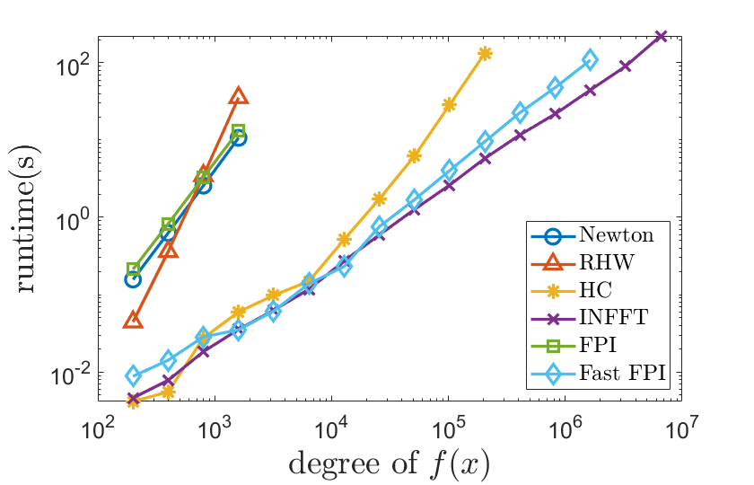
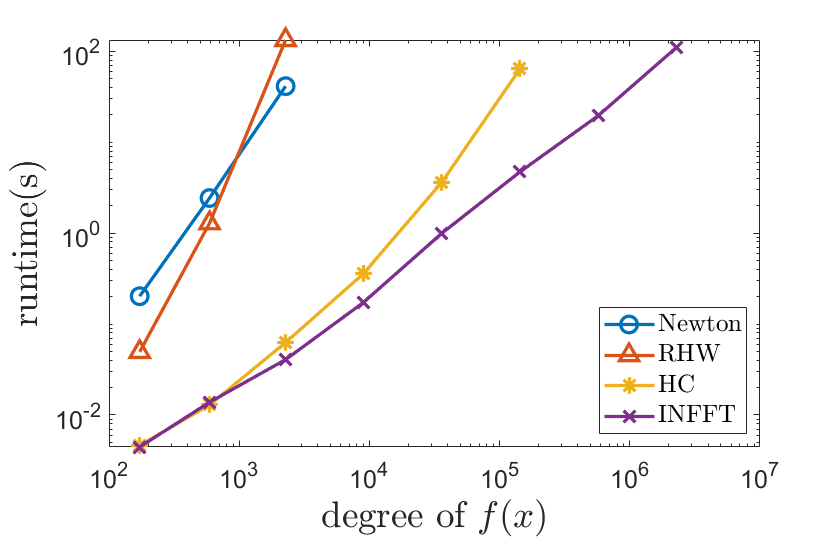

# Fast Phase Factor Finding for QSP

This repository contains code for two efficient methods for finding phase factors in Quantum Signal Processing (QSP).

## Overview

The functions `HC`, `QSP_FFPI`, and `Weiss_INFFT` implement 3 new methods for phase factor finding proposed in the papers [\[1\]](#ref1) and [\[2\]](#ref2). Additional auxiliary functions, along with selected routines from [QSPPACK](https://github.com/qsppack/QSPPACK), are included in for preformance comparison purposes.

The `HC` and `Weiss_INFFT` algorithms apply to any even or odd target polynomial $f$ satisfying $\max_{-1 \le x \le 1} |f(x)| \le 1 - \eta$, where $\eta > 0$ is a user-specified input parameter. The output of these algorithms are the reduced phase factors, i.e., the latter half of the symmetric phase factors.

The `QSP_FFPI` method supports both even and odd target polynomials $f$, but may fail to converge when $\max_{-1 \le x \le 1} |f(x)|$ approaches 1. In practice, ensuring that $\max_{-1 \le x \le 1} |f(x)| < \frac{1}{2}$ typically ensures convergence. When the polynomial degree `d` exceeds $10^5$, the default stopping criterion (`1e-12`) may be too strict due to the linear accumulation of floating-point error. A more robust setting is `opts.criteria = 1e-15 * d`. The output of this algorithm is also the reduced phase factors, but with the first component halved, following the convention of FPI algorithm.

## Example Usage

Usage examples are provided in the script `Example_HS.m`.

To reproduce the performance figures from [\[1\]](#ref1), run the scripts `runtime_test_non_fully_coherent.m` and `runtime_test_fully_coherent.m`.

## Performance 

The three proposed methods significantly outperform previous state-of-the-art techniques, as illustrated in the figures below. A detailed complexity analysis is provided in [\[1\]](#ref1) and [\[2\]](#ref2).

- Runtime comparison in the non-fully coherent setting

- Runtime comparison in the fully coherent setting

## Citing our work

-  [1] [Ni, H., & Ying, L. (2024). Fast phase factor finding for quantum signal processing. arXiv preprint arXiv:2410.06409.](https://arxiv.org/abs/2410.06409)
-  [2] [Ni, H., Sarkar, R., Ying, L., & Lin, L. (2025). Inverse nonlinear fast Fourier transform on SU (2) with applications to quantum signal processing. arXiv preprint arXiv:2505.12615.](https://arxiv.org/abs/2505.12615)
